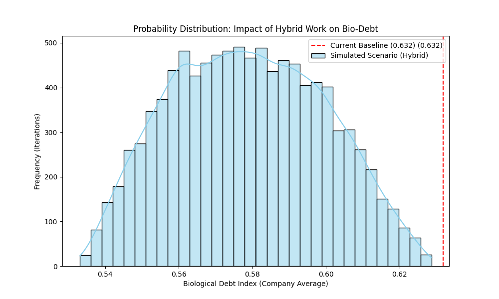

# HR Analytics: Monte Carlo Simulation for Hybrid Work Impact

> **Transitioning HR from Descriptive to Predictive Analytics:** A stochastic simulation predicting the impact of hybrid work policies on employee burnout and well-being.

## Executive Summary
Traditional People Analytics relies on historical averages, suffering from the "Fallacy of Averages"—assuming an "average" employee represents the entire workforce, which masks individual burnout risks. 

This project abandons static observation and applies **Data Science and Stochastic Modeling** to organizational behavior. By building a custom KPI (the Bio-Debt Index) and running a **10,000-iteration Monte Carlo Simulation**, this model quantifies the true ROI of hybrid work on human energy levels.

### Key Findings
* **Metric Validation:** The custom *Bio-Debt Index* proved a strong negative correlation (**-0.40**) with Job Satisfaction.
* **100% Success Probability:** Across 10,000 simulated futures, hybrid work mitigated organizational fatigue in every single scenario, even when assuming increased workload.
* **Estimated Impact:** The model predicts an **8.4% average reduction** in the global Biological Debt of the company.

---

## The Core Metric: Bio-Debt Index
To quantify the imbalance between workplace stressors and physiological recovery, I engineered a proprietary metric:

$$BioDebt = \frac{Workload + Stress + (Overtime \times 1.5)}{SleepHours + \left(\frac{PhysicalActivity}{7}\right) + 1}$$

* **Numerator (Erosion Vectors):** Workload, perceived stress, and an overtime fatigue multiplier.
* **Denominator (Regeneration Vectors):** Daily sleep and weekly physical activity average.
* **Laplace Smoothing:** A `+1` constant ensures algorithmic stability (prevents division by zero).

---

## Data Architecture & Methodology

The project was structured across a robust data pipeline:

1. **SQL Data Governance (MySQL):** * Schema design, data ingestion of 3,025 employee records, and structural integrity audits.
2. **Python Integration:** * Connecting the RDBMS to a Python environment via `SQLAlchemy` for seamless data manipulation using `pandas`.
3. **Data Quality Audit:** * Validated 0 missing values, 0 duplicates, and performed sanity checks on physiological boundaries.
4. **Stochastic Simulation (Monte Carlo):** * Injected uncertainty across 3 axes: *Commute Friction* (reduction), *Recovery Capacity* (variable sleep increase), and *Workload Intensity* (up to 10% stochastic increase to simulate the "always-on" digital paradox).
5. **Data Loopback:** * Exported the predictive risk labels back into the MySQL database for BI consumption.

---

## Probability Distribution (Simulation Results)

*The histogram proves that the entire simulated distribution (blue) shifts strictly to the left of the current baseline (red dashed line), validating hybrid work as a mathematically secure strategy for risk mitigation.*

---

## Tech Stack
* **Database:** MySQL, SQL Queries
* **Programming Language:** Python 3
* **Libraries:** `pandas`, `numpy`, `matplotlib`, `seaborn`, `sqlalchemy`
* **Techniques:** Data Engineering, Monte Carlo Simulation, Pearson Correlation, Predictive Analytics

---
*Created by Joana Inácio - Júnior Data Analyst / HR Data Scientist*
